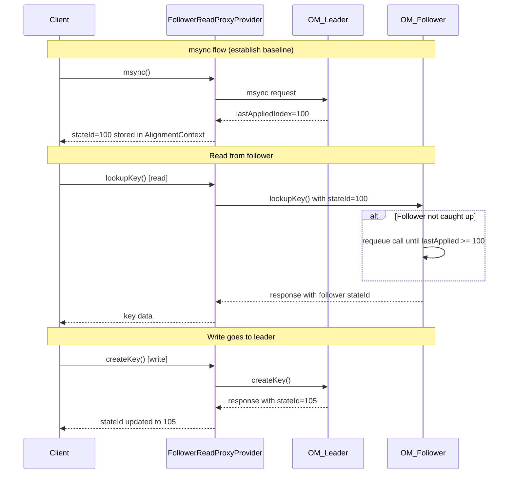

# Implement HDFS-style Follower Reads for Ozone Manager

## Overview

This plan implements consistent follower reads for Ozone Manager following the HDFS observer read pattern (HDFS-12943). The key mechanism uses `AlignmentContext` to track state IDs between client and server, allowing the server to requeue requests until followers catch up to the client's expected state.

## Architecture Flow

## Key Files to Create/Modify

### 1. Client-side AlignmentContext

Create [`hadoop-ozone/common/src/main/java/org/apache/hadoop/ozone/om/ha/OMClientAlignmentContext.java`](hadoop-ozone/common/src/main/java/org/apache/hadoop/ozone/om/ha/OMClientAlignmentContext.java) implementing `AlignmentContext`:

- Track `lastSeenStateId` received from OM responses
- `updateRequestState()`: Set `stateId` in RPC request header  
- `receiveResponseState()`: Update `lastSeenStateId` from RPC response header
- `isCoordinatedCall()`: Return true for read operations that need coordination

### 2. Server-side AlignmentContext  

Create [`hadoop-ozone/ozone-manager/src/main/java/org/apache/hadoop/ozone/om/ha/OMServerAlignmentContext.java`](hadoop-ozone/ozone-manager/src/main/java/org/apache/hadoop/ozone/om/ha/OMServerAlignmentContext.java) implementing `AlignmentContext`:

- `getLastSeenStateId()`: Return `OzoneManagerStateMachine.getLastAppliedTermIndex().getIndex()`
- `updateResponseState()`: Set current `lastAppliedIndex` in RPC response header
- `receiveRequestState()`: Extract client's `stateId` from request header
- `isCoordinatedCall()`: Identify which methods need coordination (read ops to followers)

### 3. Follower Read Proxy Provider

Create [`hadoop-ozone/common/src/main/java/org/apache/hadoop/ozone/om/ha/OMFollowerReadProxyProvider.java`](hadoop-ozone/common/src/main/java/org/apache/hadoop/ozone/om/ha/OMFollowerReadProxyProvider.java):

- Extend `OMFailoverProxyProviderBase`
- Route read requests to OM followers (round-robin among followers)
- Route write requests and msync to OM leader
- Track current leader vs follower nodes
- Handle fallback to leader on follower failures

### 4. msync Request Type

Add new OMRequest type for msync in protobuf:

- Modify [`hadoop-ozone/interface-client/src/main/proto/OmClientProtocol.proto`](hadoop-ozone/interface-client/src/main/proto/OmClientProtocol.proto)
- Add `Msync` to `Type` enum and create `MsyncRequest`/`MsyncResponse` messages
- Response includes current `lastAppliedIndex` from leader

### 5. Server Integration

Modify [`hadoop-ozone/ozone-manager/src/main/java/org/apache/hadoop/ozone/om/OzoneManager.java`](hadoop-ozone/ozone-manager/src/main/java/org/apache/hadoop/ozone/om/OzoneManager.java):

- Create `OMServerAlignmentContext` during initialization
- Pass AlignmentContext to `RPC.Builder.setAlignmentContext()` in `startRpcServer()`
- Add msync request handler in [`OzoneManagerRequestHandler.java`](hadoop-ozone/ozone-manager/src/main/java/org/apache/hadoop/ozone/protocolPB/OzoneManagerRequestHandler.java)

### 6. Client Integration  

Modify [`hadoop-ozone/common/src/main/java/org/apache/hadoop/ozone/om/protocolPB/Hadoop3OmTransport.java`](hadoop-ozone/common/src/main/java/org/apache/hadoop/ozone/om/protocolPB/Hadoop3OmTransport.java):

- Add option to use `OMFollowerReadProxyProvider` instead of `HadoopRpcOMFailoverProxyProvider`
- Pass `OMClientAlignmentContext` to proxy creation

### 7. Configuration

Add configuration keys to [`hadoop-ozone/common/src/main/java/org/apache/hadoop/ozone/om/OMConfigKeys.java`](hadoop-ozone/common/src/main/java/org/apache/hadoop/ozone/om/OMConfigKeys.java):

- `ozone.om.follower.read.enabled` (default: false)
- `ozone.om.follower.read.auto.msync.enabled` (auto-msync before reads)
- `ozone.om.follower.read.stale.threshold.ms` (max staleness before forcing msync)

## Existing Infrastructure Leveraged

- AlignmentContext interface: [`hadoop-hdds/common/src/main/java/org/apache/hadoop/ipc_/AlignmentContext.java`](hadoop-hdds/common/src/main/java/org/apache/hadoop/ipc_/AlignmentContext.java) - already exists
- Server requeue logic: [`Server.Handler.run()`](hadoop-hdds/common/src/main/java/org/apache/hadoop/ipc_/Server.java) lines 2920-2940 - already implements call requeuing when `clientStateId > alignmentContext.getLastSeenStateId()`
- StateMachine index: [`OzoneManagerStateMachine.getLastAppliedTermIndex()`](hadoop-ozone/ozone-manager/src/main/java/org/apache/hadoop/ozone/om/ratis/OzoneManagerStateMachine.java) - provides last applied Ratis index
- Read/Write classification: [`OmUtils.isReadOnly()`](hadoop-ozone/common/src/main/java/org/apache/hadoop/ozone/OmUtils.java) - determines if request is read-only

## Limitations

- Only supports Hadoop RPC clients (gRPC requires separate implementation)